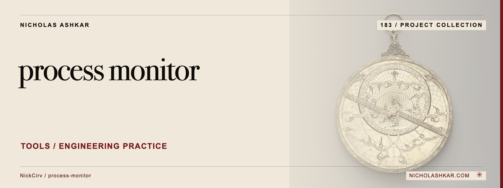

# process-monitor

Inspect process CPU and memory data in a terminal or a JSON snapshot.

Provides PID/name filtering, sorting, a live TUI, threshold alerts and optional CSV logging. macOS uses system tools; Linux also reads proc data.


<a id="install"></a>

## Quickstart

Package runtime requirement: Node.js `>=20`. Git is needed to obtain this pinned source checkout.

```bash
git clone https://github.com/NickCirv/process-monitor.git
cd process-monitor
git checkout ce7361d99ebe70631787c95712effd1aa83756a7
node index.js --json --limit 10
```

This source-derived example has not been executed in this review. The command emits a one-time process/system snapshot and exits. Values depend on the host.


<a id="what-it-does"></a>

## Usage

```bash
node index.js --name node --sort mem --limit 10
node index.js --pid 12345 --interval 1000
node index.js --log metrics.csv
```

`--watch <command>` launches a command and monitors it. In the TUI, `k` sends SIGTERM and `K` sends SIGKILL to the selected process.

[Command reference](docs/REFERENCE.md) covers arguments, modes and output controls.

## Behavior and limits

This is not a passive-only interface: watch mode starts processes, log mode writes files and kill keys send signals. CPU/RSS readings have platform-specific semantics and are not a profiling trace. Process command lines and logs may contain local details. The captured tree lacks a LICENSE file despite MIT package metadata.

## Development

Declared package scripts:

| Script | Command |
| --- | --- |
| `test` | `node --test` |

The smoke test syntax-checks the entrypoint; it does not exercise CLI behavior or integrations.

## Research

[Source review and claim ledger](docs/RESEARCH.md) records revision `ce7361d99ebe`, inspected files and verification gaps.

## License and attribution

No license file was captured at this revision. A package metadata license field does not supply missing license text; confirm reuse terms before redistribution.

[Artwork credits](assets/nicholas-ashkar/CREDITS.md) · [Nicholas Ashkar — consulting](https://nicholashkar.com/#oxblood-contact)
